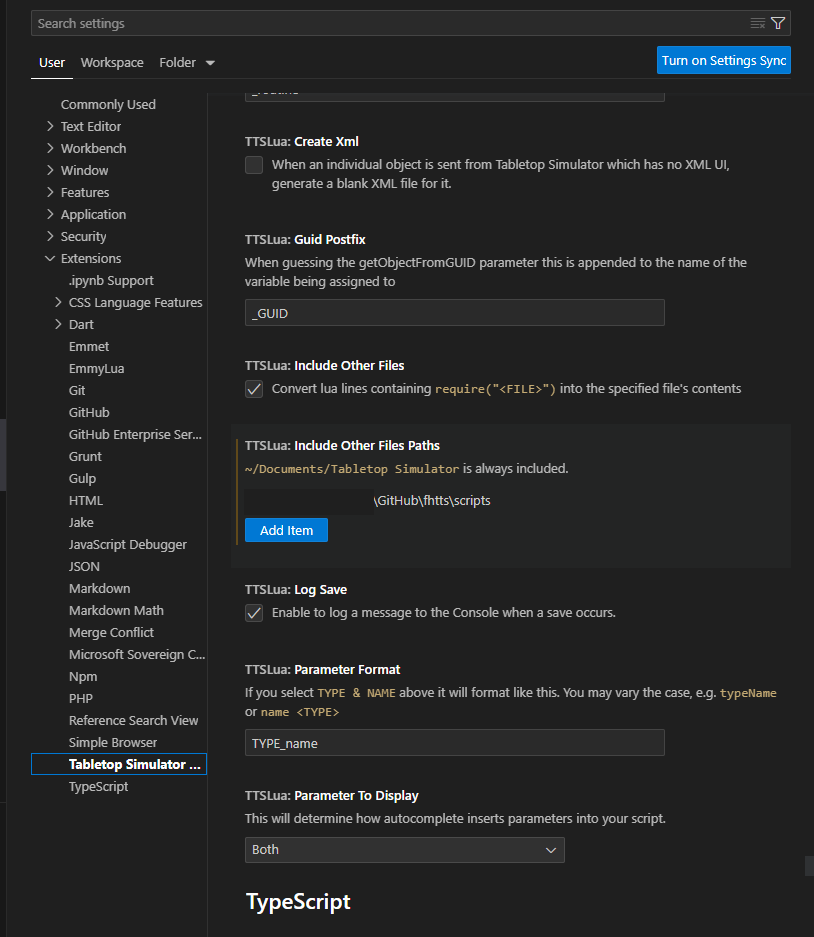

# Setting up a Dev Environment for TTS

## Fork and Clone the Github repository to your local machine
If you aren't familiar with github or version control, check here for a guide on how to get set up:
[Github Quickstart](https://docs.github.com/en/get-started/quickstart)

## Download Visual Studio Code
You will need to use VS Code in order to utilize an extension that allows direct integration of the IDE with Tabletop Simulator. It can be downloaded from the official website here:
[Visual Studio Code](https://code.visualstudio.com/download)

## Install the Tabletop Simulator Lua extension
Open the Extensions panel by going to View > Extensions or pressing Ctrl + Shift + X.
Search for "Tabletop Simulator Lua" and install the plugin.

## (Optional) Install a Lua language extension
I use EmmyLua, but any Lua extension will improve your experience.

## Important! Update your TTS Lua extension settings
The extension needs to know what directories to use when connecting to TTS. Open your settings panel (File > Preferences > Settings), go to Extensions > Tabletop Simulator Lua, and find the setting labeled TTSLua: Include Other Files Paths. Here, you'll want to insert the path to the scripts folder within your clone of the repository. If you're planning on working on multiple TTS mods, make sure you're adding this setting to a workspace that is unique to each project. See below for an example:

## Useful tips
The most important things you'll need to know are the keybinds Ctrl + Alt + L (to load scripts from TTS into VS Code) and Ctrl + Alt + S (save your scripts in VS Code and export them to TTS, triggering a reload). You'll want to be using the save files in the "tts saves" directory as a baseline; either save 100 (the version that goes up on the workshop) or save 101 (has a few additional developer tools). I made a symlink from my TTS saves directory to the files in my Github directory, but copying them back and forth works fine as well.

Looking at the code itself, you'll be working almost entirely within the scripts directory when working with Tabletop Simulator. The Global and Scenario Mat files are good places to start, as a lot of the core game logic is contained within.