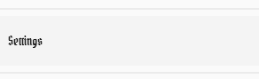
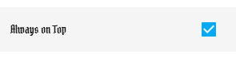
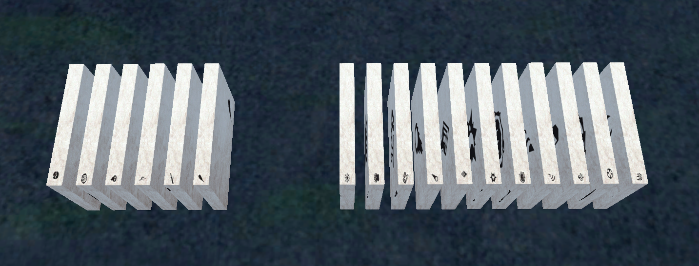
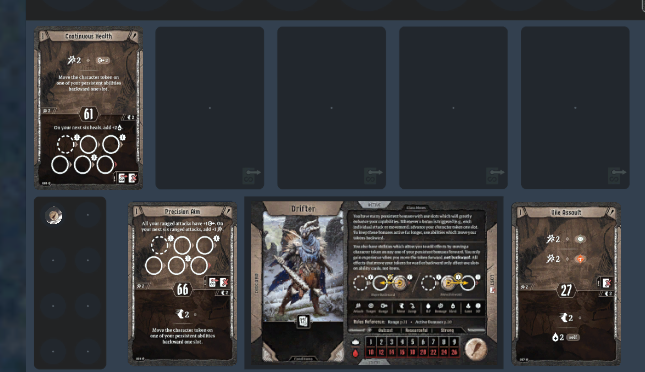

# Getting Started

## Download and install the Frosthaven Asssitant
Builds are available for windows, mac osx, and android.  
[Frosthaven Assistant](https://github.com/gudyfr/FrosthavenAssistant/releases)  
If you plan on using the narration integration, a desktop build is recommended.  

## Configure the Frosthaven Assistant
Open the Main menu, choose Settings :  
  
Scroll down to "Also Enable Web Server", and enable it  
  
Make sure you turn off "Auto Add Standees" and "Auto Add Timed Spawns" as these will conflict with TTS driving the assistant to add standees.  
  
(Optional) There is also an option to keep the Assistant on top of other windows, which can be useful to have it visible on top of TTS  
  
Finally, you need to Start the Host Server (which also starts the web server), notice that the label changes to "Stop Server"  
  
**Upon next launches of the Assistant, you can simply start the server from the main menu**  
  

## Setup TTS
Locate the Settings mat and make sure that "Enable X-Haven assistant is checked", in addition the address and port should be valid for you if you are the host and do not plan on using the narration.
  
### If you plan on using the narration integration
The assistant can download the narration files, assuming you provide it with a valid email and password and that you have purchased the narration. For other players to access the narration audio, you will need to change the Address settings to your public IP Address, and setup proper port forwarding to the Assistant.
### Key bindings
There are custom key bindings for common actions, to set these up locate the Game Keys menu under Options  
 
And set them up appropriately. **You may want to check that those keys are not also set for other shortcuts under Menu / Configuration**.  
 

## Setting up Characters
To setup characters you simply drop a character envelope onto a player mat. The starting six character classes are grouped together on the left of all character envelopes.  
  
  
  

## Using the Campaign Tracker
There are 5 campaign tracker mats, which look like  
  
Simply click any scenario number to unlock the scenario  
  
Once a scenario has been unlocked it will look like  
  
You can undo (relock) the scenario by clicking above its title  
  
You can load the scenario by clicking its title  
  
And you can mark a scenario complete by clicking its checkbox  
  
Additionaly, if a scenario can be blocked out, you can click the appropriate location as well  

## Using the Scenario Picker
The Scenario Picker shows available scenarios. You can also start a scenario from the Scenario Picker by clicking its title  

## Setting up a Scenario
Once you load a scenario, it should be layed out automatically. **Some scenarios are not currently properly handled, and when this is the case, simply uncheck the "Automatic Scenario Layout" under Settings", try again, and manually setup the scenario. Its elements will still be provided to you.**  
  
Some components of a Scenario are actionable **The scripting of scenarios is not 100% complete, and in the event the scenario you're playing isn't complete, you will need to manually layout the subsequent rooms.**  
Starting locations can be clicked to make them all disapear  
  
Doors can be clicked to open them and reveal the next room  
  
In some scenarios, the pressure plates (or tokens) have been scripted, and a character needs to be placed there to activate them  
Some conditions are currently too complicated to be implemented automatically, in these situations a token will be added next to the map to trigger the appropriate section  
 

## Playing a scenario
### Overall round process
For each round, you want to first place your ability cards on the Scenario mat, either using key bindings or simply dropping them at the right location.  
  
Then, once everyone is ready, you can press the "Start" button to reveal the cards. The initiative should be sent to X-Haven Assistant, which will now display the turn order.  
  
  
Track the progress of the round in X-Haven assistant, and at the end of the round, you want to end the round from TTS, by pressing the "End" button.  
  
Ability Cards are automatically returned to the appropriate Player mat, at the correct location  
If a card was used as a persistent ability, or a loss, simply click the appropriate toggle **before** ending the round.  
  
It should be sent to the appropriate location as well  
  
**It is currently required that you Start and End rounds from TTS. Doing so from X-Haven Assistant will not work.**  

### Attack modidiers
On the side of the TTS window, there is a toggle button to enable the Attack Modifier UI  
  
Clicking it will expand / collapse the Attack Modifier UI  
  
Clicking the Draw button will draw an attack modifier card for the player who pressed the button, and will display the results to all players.  
  
Monsters and Allies Attack Modifiers should be drawn from the X-Haven Assistant UI.  
The deck is shuffled automatically when needed. In addition Curse and Bless cards are automatically returned to their appropriate decks at the end of each round. Minus one Cards are returned to their appropriate deck whenever a "Cleanup" occurs.

### Looting
If a monster dies it will drop a loot token (unless there are specials rules to prevent this, in which case it might drop nothing, or the appropriate item/overlay)  
  
If a character is on top of a loot token at the end its round, the loot token will be automatically looted. **Use the Assistant UI to end a chracter round. For the loot to work, the character had to be active in the assistant, ie skipping a character's turn will result in looting not working for that character.**  
  
  

## Saving Progress and Updating
In order to update to a recent version of the mod, you will first need to save your campaign progress.  
This can be accomplished using the Campaigns mat.  
  
The state of all boards (except the scenario board) will be saved. You should ensure that all elements are at their appropriate locations before saving, in particular :
 - items should be on either the items mat or player mats (in items positions)
 - ability cards should be on player mats (only)
Each save "box" is a container in which you can add any custom object you would have added to your campaign (notes, retired player sheets, etc ...)
  
From there, you want to save this object  
  
**Update your save to the latest version of the mod**  
and import your saved object using the menu "Objects" / "Saved Objects", and drop it at the right location. Your progress should be restored.    
